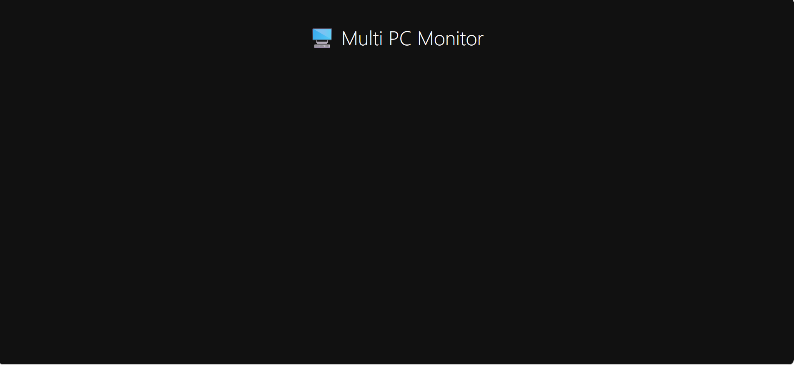
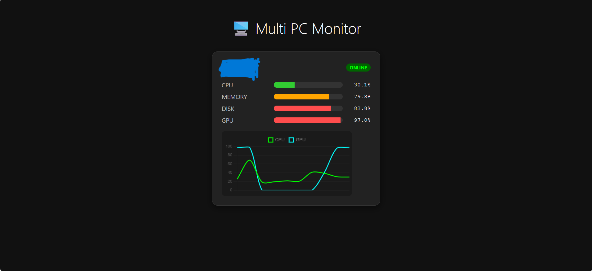
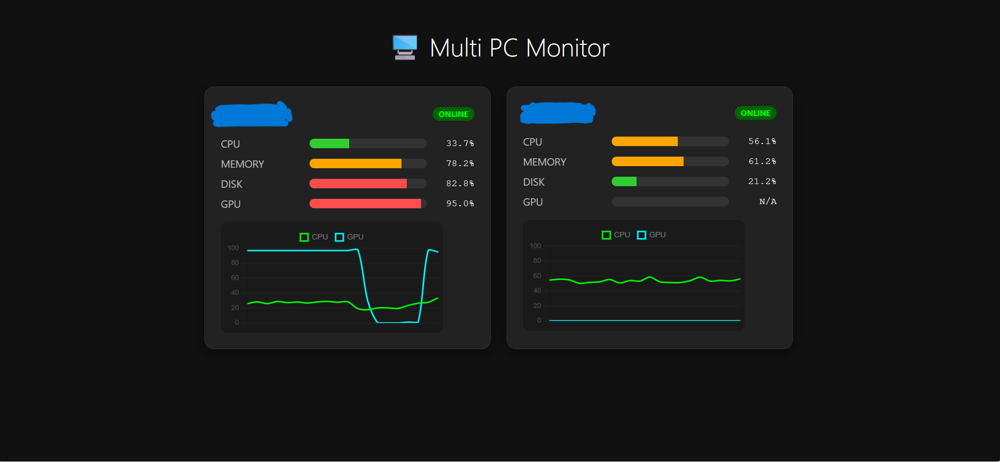
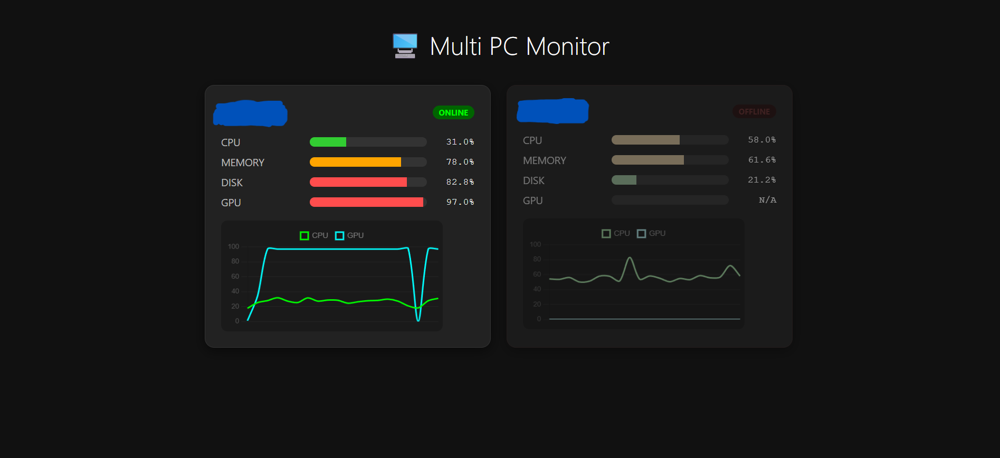
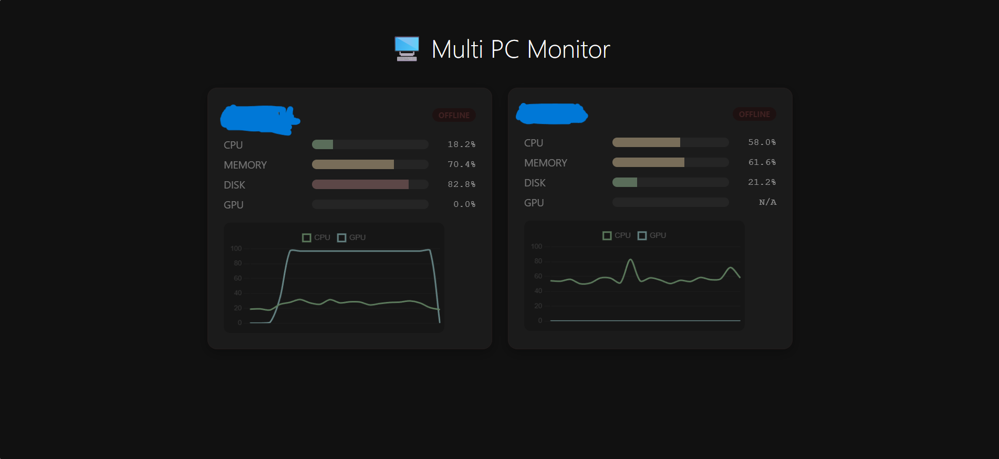

- 監視部分
  ```
  agent.py (各PC)
      ↓ POST /metrics (CPU, メモリ, ディスク, GPU)
  server.py (receive_metrics)
      ↓
  SQLite (metrics.db)
      ↑
      ├─ GET /latest_all → 全ホストの最新データ + ステータス
      └─ GET /history/{host} → グラフ用の過去20件
  ```


## 目次
1. このプロジェクトについて
2. 概要
3. プロジェクトファイルの説明
4. システム構成イメージ
5. 動作画面
6. 準備(使用ライブラリとソースコード変更箇所)
7. 使用方法
8. 今後の展望


## このプロジェクトについて
複数のPCの稼働状況とリソース使用状況をリアルタイム監視することができるプロジェクトです。

## 概要
研究室で稼働している複数のPCの状態を、一台の監視用PCを用いることで一括監視することができるよう開発しました。
監視対象で動かしているエージェントが各PCの情報を収集し、監視用PCで集約して可視化します。以下のリソースの使用状況を確認できます。

* CPU
* メモリ
* ディスク
* GPU(GPU無しの場合は、`N/A`として処理)

CPU使用率とGPU使用率はリアルタイムで変動するグラフで視覚的にわかりやすくしました。

## プロジェクトファイルの説明

* **server.py** (監視用PC)
  - FastAPIを使用した中央集計プログラム。
  - 各PCから送られてくる負荷データを受け取り、SQLiteデータベース（`metrics.db`）に保存します。
  - フロントエンド（index.html）へ最新データを提供するAPIサーバーの役割も担います。

* **agent.py** (監視対象PC)
  - 監視したいPC（対象機）側で常駐させるプログラム。
  - `psutil` を使用してCPU、メモリ、ディスク、負荷を1秒ごとに計測し、サーバーへ送信します。
  - `gputil` を使用してGPUの情報も取得

* **index.html** (UI)
  - ブラウザで開くモニタリング画面。
  - `Chart.js` を使用し、サーバーから取得したデータをグラフや進捗バーで視覚的に表示します。
  - 30秒以上更新がない(情報が伝送されていない)PCを「OFFLINE」として表示する。

* **requirements.txt**
  - プロジェクトの実行に必要なPythonライブラリの一覧（`fastapi`, `psutil`など）。


## システム構成イメージ
[Monitoring PC 1] --(HTTP POST)--> [Server PC (server.py)] <--(HTTP GET)-- [Browser (index.html)]
[Target PC 2] --(HTTP POST)-->          ↑
[Target PC 3] --(HTTP POST)--> [SQLite DB]

## 動作画面
# 初期画面


# 1つのサーバ管理


# 2つのサーバ管理


# オフライン機能


# 終了画面



## 準備 (使用ライブラリとソースコードの変更箇所)
1. 必要ライブラリをインストールする
```
pip install -r requirements.txt

```
**ソースコード変更箇所**
2. server.pyの**Allowed_IPS**にPCに監視用PCと監視対象PCのIPを入力
3. agent.pyの**URL = "http://xxx.xxx.xxx.xxx:port/metrics"**に監視用PCのIPアドレスを入力する
4. index.htmlの**const API_BASE** を対応させる


## 使用方法
1. 監視用PCでserver.py以下のコマンドで起動
```
uvicorn server:app --host <YOUR_IP_ADDRESS> --port <PORT_NUMBER>
```
2. 監視対象PCすべてでagent.pyを実行
```
python agent.py
```
3. index.htmlを開く

## 今後の展望
- サーバ使用者を確認できる機能の追加
- サーバのスケジューリング機能(予約関連システム)
- LLMを用いたスケジューリング最適化提案機能