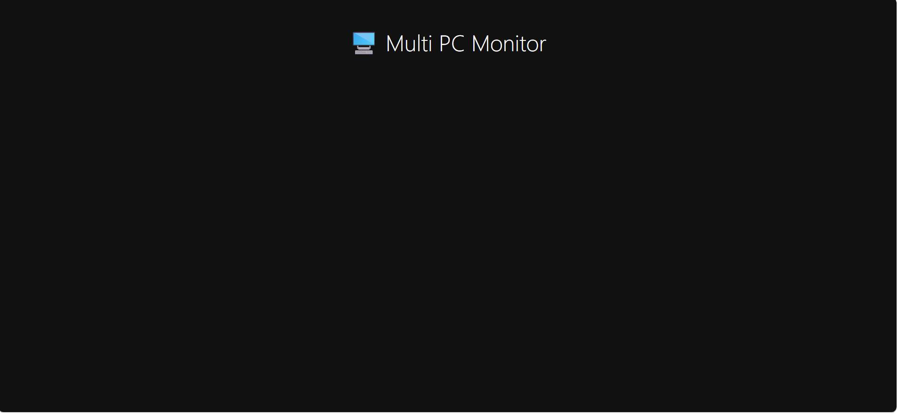
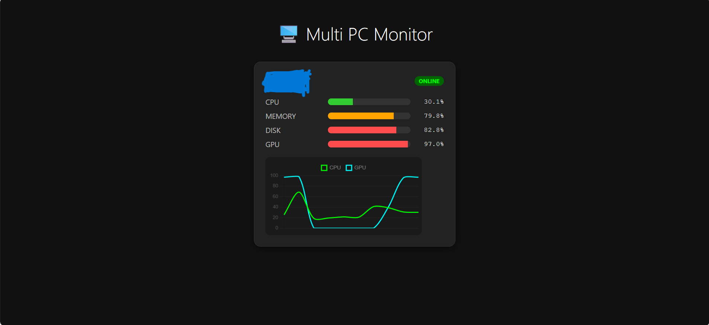
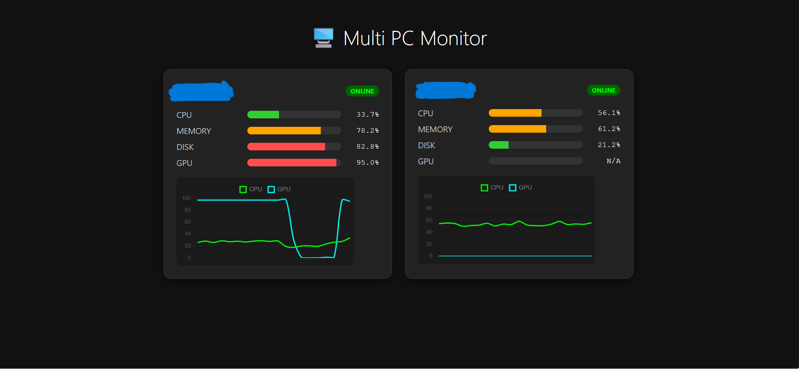
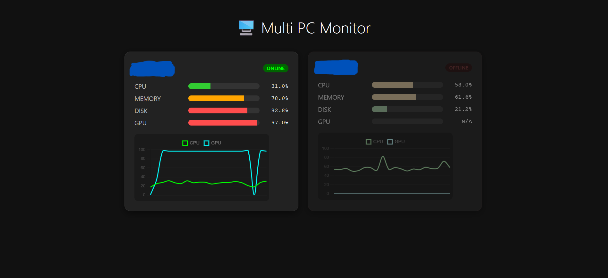
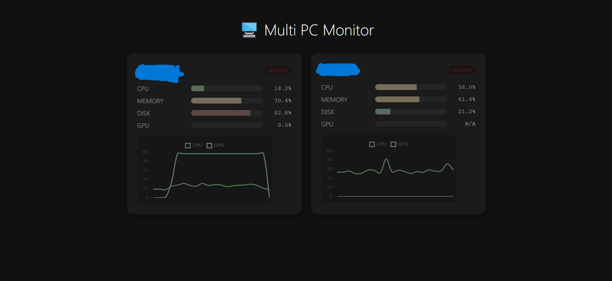

## 目次
1. このプロジェクトについて
2. 概要
3. プロジェクトファイルの説明
4. システム構成イメージ
5. 動作画面
6. 環境構築と設定
7. 使用方法
8. 今後の展望


## このプロジェクトについて
複数のPCの稼働状況とリソース使用状況をリアルタイム監視することができるプロジェクトです。

## 概要
研究室で稼働している複数のPCの状態を、一台の監視用PCを用いることで一括監視することができるよう開発しました。
監視対象で動かしているエージェントが各PCの情報を収集し、監視用PCで集約して可視化します。以下のリソースの使用状況を確認できます。

* CPU
* メモリ
* ディスク
* GPU(GPU無しの場合は、`N/A`として処理)

CPU使用率とGPU使用率はリアルタイムで変動するグラフで視覚的にわかりやすくしました。

## プロジェクトファイルの説明

* **server.py** (監視用PC)
  - FastAPIを使用した中央集計プログラムです。
  - 各PCから送られてくる負荷データを受け取り、SQLiteデータベース（既定では`metrics.db`）に保存します。
  - フロントエンド（index.html）へ最新データを提供するAPIサーバーの役割も担います。

* **agent.py** (監視対象PC)
  - 監視したいPC（対象機）側で常駐させるプログラムです。
  - `psutil` を使用してCPU、メモリ、ディスクの使用率を計測し、サーバーへ送信します。計測時間と送信後の待機時間は設定で変更できます。
  - `GPUtil` を使用してGPUの情報も取得可能です。

* **index.html** (UI)
  - ブラウザで開くモニタリング画面です。
  - `Chart.js` を使用し、サーバーから取得したデータをグラフや進捗バーで視覚的に表示します。
  - サーバーが最終受信からの経過時間でONLINE / OFFLINEを判定し、画面に表示します（既定では30秒以上でOFFLINE）。

* **config.py**
  - Pydantic Settingsによる設定管理です。`AgentSettings`は`AGENT_`、`ServerSettings`は`SERVER_`のprefixを使って設定を読み込みます。

* **.env.example**
  - 必要な設定項目を共有するためのテンプレートです。コピーしてローカルの`.env`を作成します。

* **pyproject.toml / uv.lock / .python-version**
  - Python依存関係とロック情報、使用するPythonバージョンを管理します。`.python-version`は3.11を指定しています。
  - 主な使用技術はPython、FastAPI、Uvicorn、SQLite、psutil、requests、GPUtil、Pydantic Settings、Chart.jsです。


## システム構成イメージ
  ```
  agent.py (各PC)
      ↓ POST /metrics (CPU, メモリ, ディスク, GPU)
  server.py (receive_metrics)
      ↓
  SQLite (metrics.db)
      ↑
      ├─ GET /latest_all → 全ホストの最新データ + ステータス
      └─ GET /history/{host} → グラフ用の過去20件
      ↓
  index.html(ブラウザ UI / 可視化)
  ```


## 動作画面
### 初期画面

- agent.pyを起動していない状態です。

### 1つのサーバ管理

- CPU/GPUの負荷推移をリアルタイムにグラフ化することで、負荷変動を視覚的に確認可能です。

### 2つのサーバ管理

- 監視対象が増えても、分割して表示します。

### オフライン機能

- サーバがオフラインになる(agent.pyが終了する)とグレーアウトして、直観的に把握できるように設計しました。

### 終了画面

- 全てのサーバが停止した状態。


## 環境構築と設定

### 環境構築

監視用PCと各監視対象PCにuvをインストールし、それぞれで以下を実行します。Pythonは3.11系を使用し、uvで依存関係を管理します。

```bash
git clone https://github.com/TA-HA08/PC-monitoring.git
cd PC-monitoring
uv sync
```

`uv sync`で`pyproject.toml`と`uv.lock`に基づいて実行環境を構築します。

### 設定方法

リポジトリのルートでテンプレートをコピーし、各PCの環境に合わせて`.env`を編集します。以降の起動コマンドもこのディレクトリで実行してください。

```bash
cp .env.example .env
```

現在の`.env.example`は、同じPC上でServerとAgentを動かすローカル確認用の設定です。

```dotenv
# Agent settings
AGENT_SERVER_URL=http://127.0.0.1:8000/metrics
AGENT_REQUEST_TIMEOUT_SECONDS=1.0
AGENT_SEND_INTERVAL_SECONDS=1.0
AGENT_CPU_SAMPLE_INTERVAL_SECONDS=0.5
AGENT_DISK_PATH=/

# Server settings
SERVER_ALLOWED_IPS=["127.0.0.1"]
SERVER_DATABASE_PATH=metrics.db
SERVER_OFFLINE_THRESHOLD_SECONDS=30
```

| 環境変数 | 役割 | 未指定時の既定値 |
| --- | --- | --- |
| `AGENT_SERVER_URL` | Agentがメトリクスを送信するFastAPI Serverの`/metrics` URL | 必須（既定値なし） |
| `AGENT_REQUEST_TIMEOUT_SECONDS` | 送信リクエストのタイムアウト（秒、0より大きい値） | `1.0` |
| `AGENT_SEND_INTERVAL_SECONDS` | 各ループの計測・送信処理後の待機時間（秒、0より大きい値） | `1.0` |
| `AGENT_CPU_SAMPLE_INTERVAL_SECONDS` | CPU使用率の計測時間（秒、0以上） | `0.5` |
| `AGENT_DISK_PATH` | ディスク使用率を計測するパス。OSに合わせて指定 | `/` |
| `SERVER_ALLOWED_IPS` | メトリクスの送信を許可する接続元IPのJSON配列 | `[]`（どのIPからも受信を許可しない） |
| `SERVER_DATABASE_PATH` | SQLiteのDBファイルパス。相対パスは実行ディレクトリ基準 | `metrics.db` |
| `SERVER_OFFLINE_THRESHOLD_SECONDS` | 最終受信からOFFLINEと判定するまでの時間（秒、0より大きい値） | `30.0` |

複数PCで使用する場合は、各Agentの`AGENT_SERVER_URL`を監視用PCのURL（`http://<SERVER_IP>:8000/metrics`）に変更し、Serverの`SERVER_ALLOWED_IPS`に各Agentの接続元IPを登録します。JSON配列形式の例は以下です（例示用のIPです）。

```dotenv
SERVER_ALLOWED_IPS=["127.0.0.1","192.168.1.20"]
```

環境ごとに変わる値はソースコードから分離し、Pydantic Settingsで型変換とvalidationを行います。`.env`はローカル環境固有の設定に使用し、Git管理対象外のためGitHubにコミットしません。必要な設定項目を共有する`.env.example`はGit管理します。OSの環境変数でも設定でき、同じ項目では`.env`より優先されます。

## 使用方法

### 1. Server起動（監視用PC）

```bash
uv run uvicorn server:app --host 0.0.0.0 --port 8000
```

### 2. Agent起動（各監視対象PC）

```bash
uv run python agent.py
```

### 3. 監視画面を表示

Server起動後、ブラウザでFastAPI Serverの`/`にアクセスします。`server.py`が`index.html`を配信します。

```text
http://<SERVER_IP>:8000/
```

ローカル動作確認では以下を使用します。

```text
http://127.0.0.1:8000/
```

Frontendは`/latest_all`と`/history/{host}`を同一Originの相対URLで取得するため、Frontend側でServer IPやAPI Server URLを設定する必要はありません。

## 今後の展望

以下は未実装の改善候補です。

- サーバ使用者を確認できる機能の追加
- サーバのスケジューリング機能(予約関連システム)
- LLMを用いたスケジューリング最適化提案機能
